# R_Analytics_For_Movies

R Programming A-Z™: R For Data Science With Real Exercises! 
(Data Analytics, Data Science, Statistical Analysis, Packages, Functions, GGPlot2) 

Course by Kirill Eremenko, SuperDataScience Team

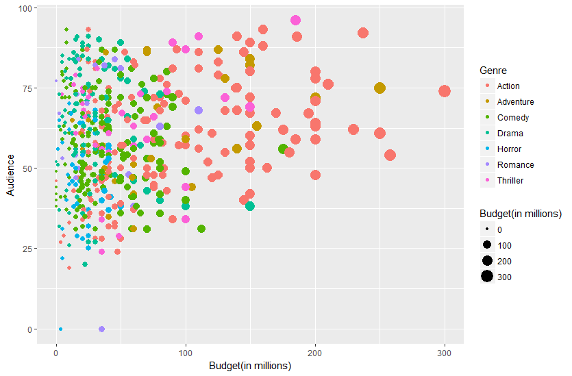

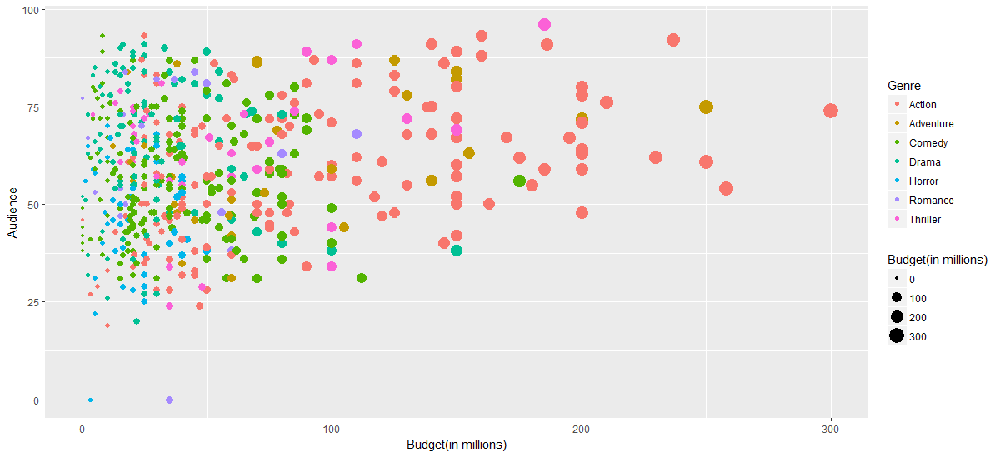

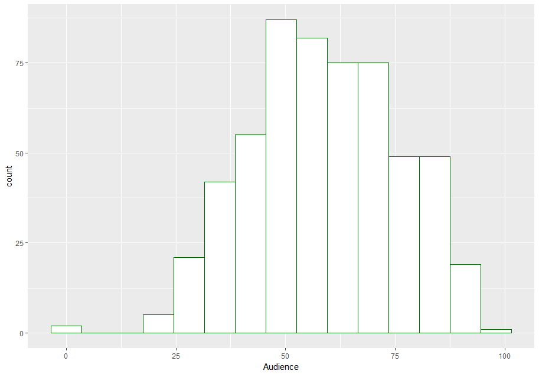

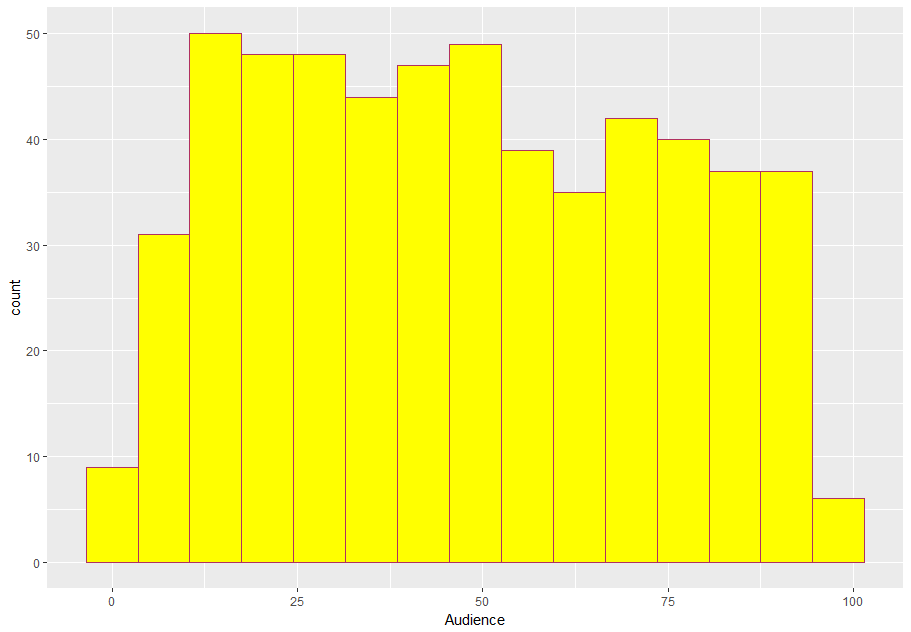

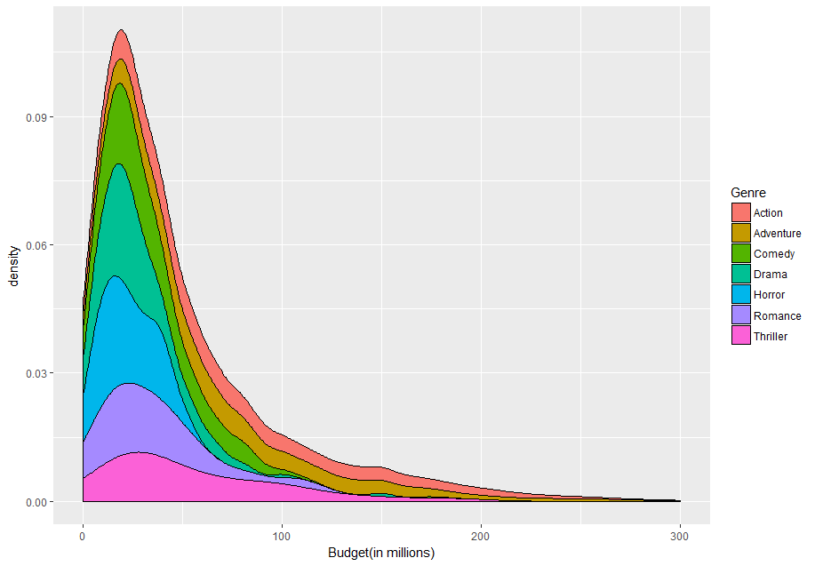

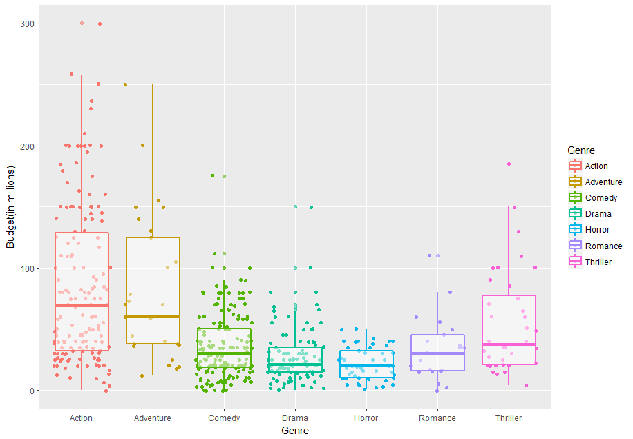

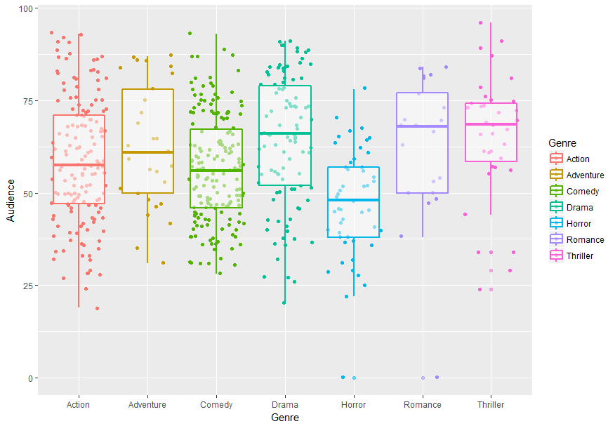

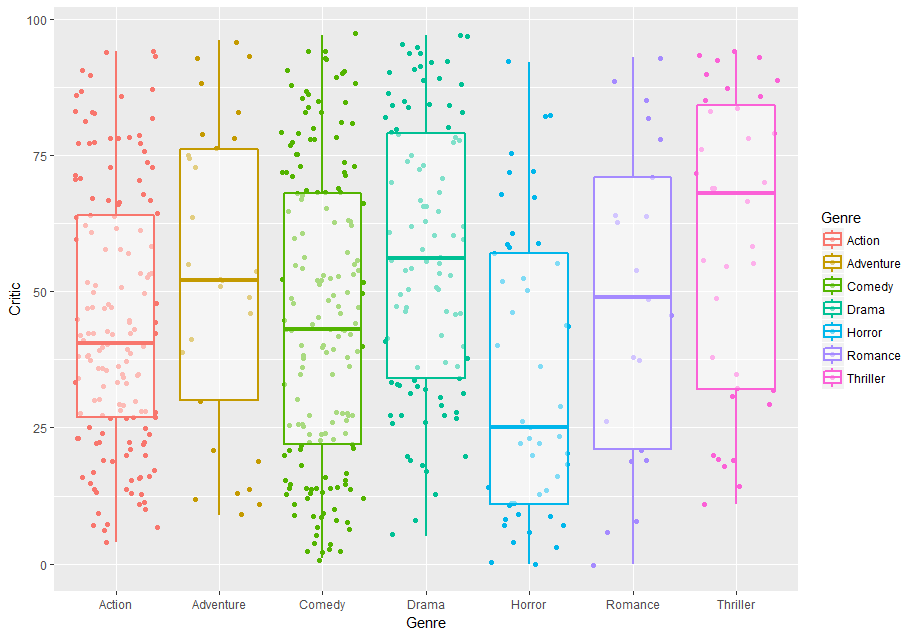

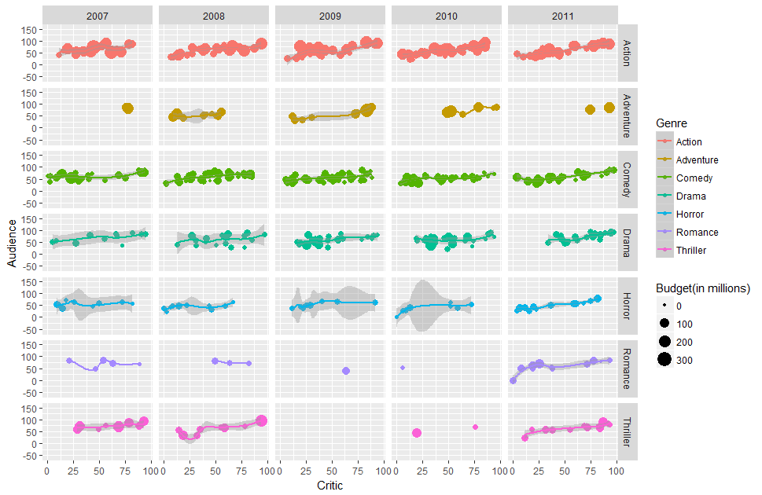

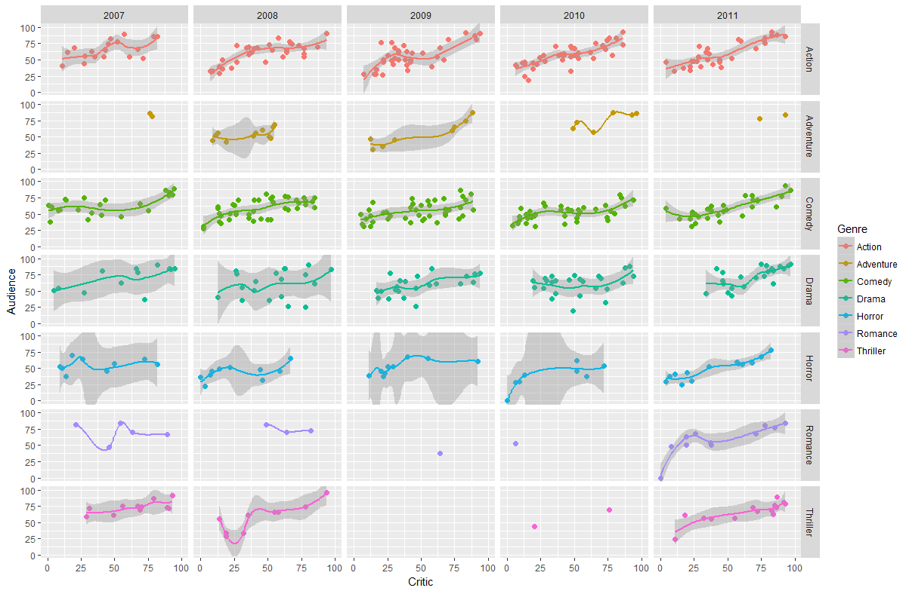

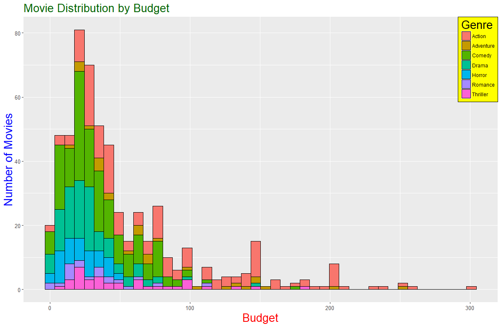

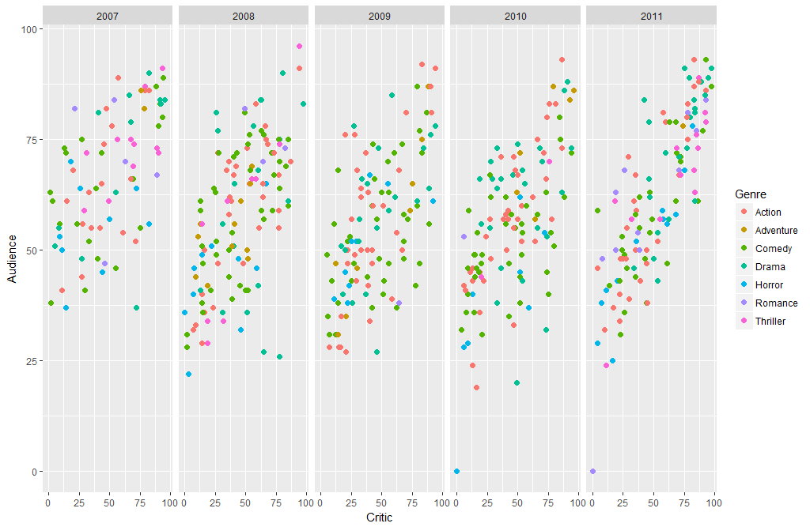

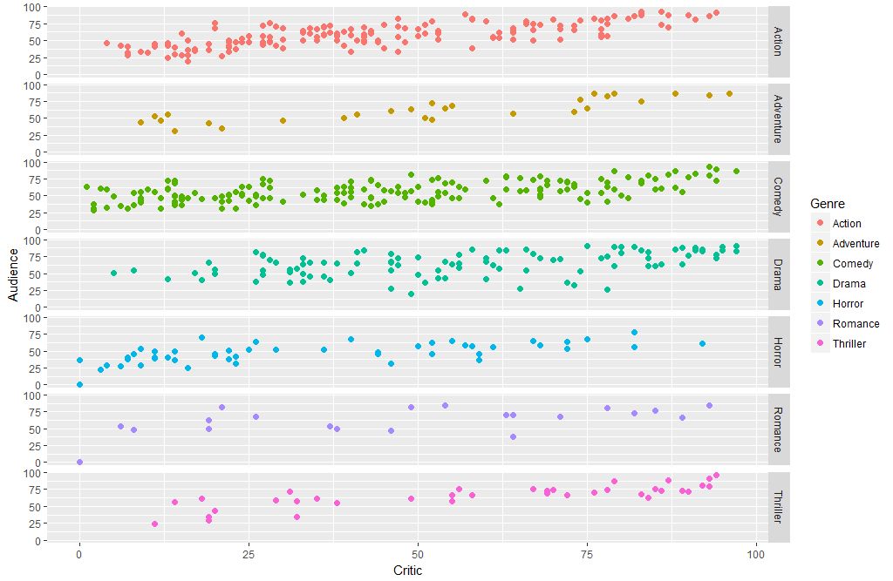

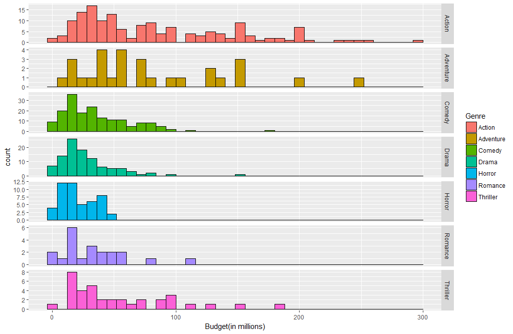

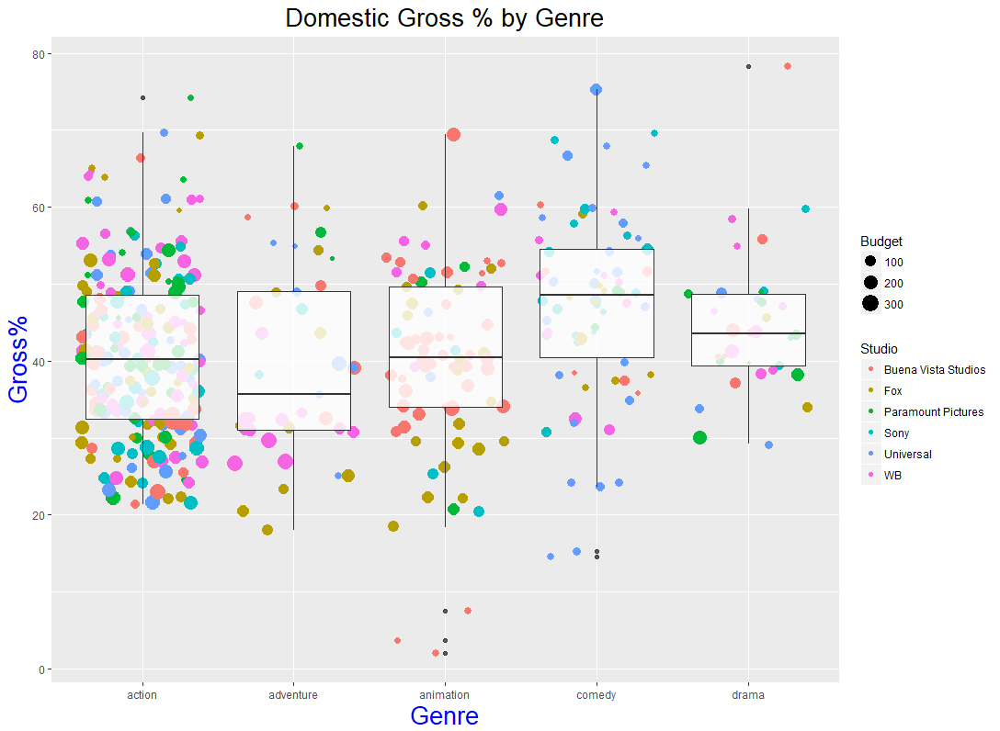

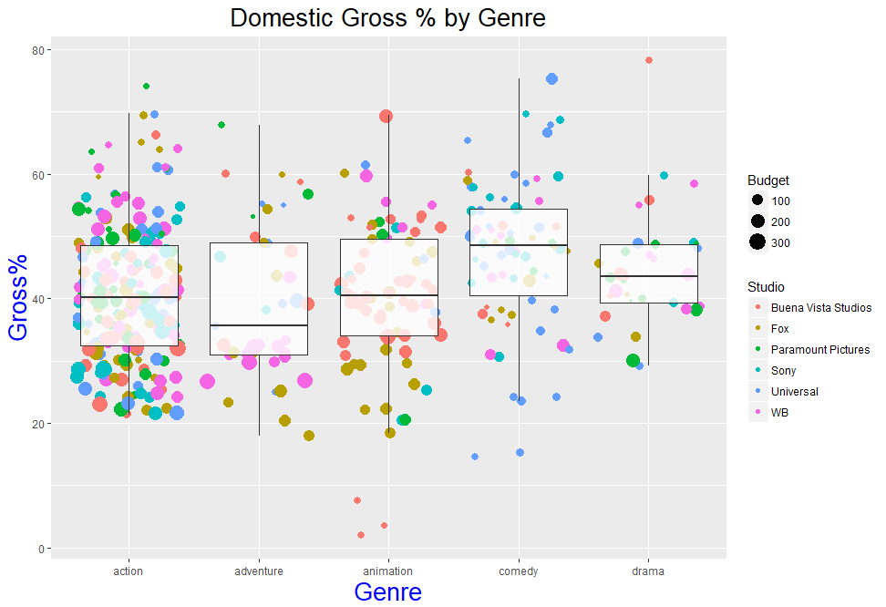
